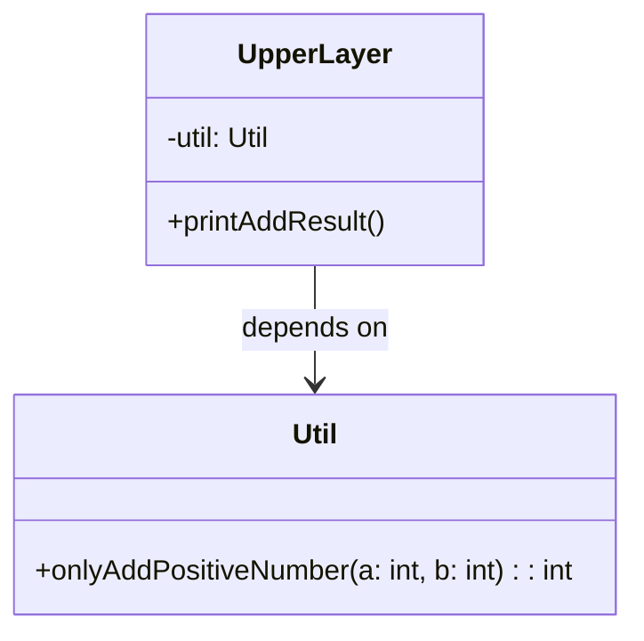
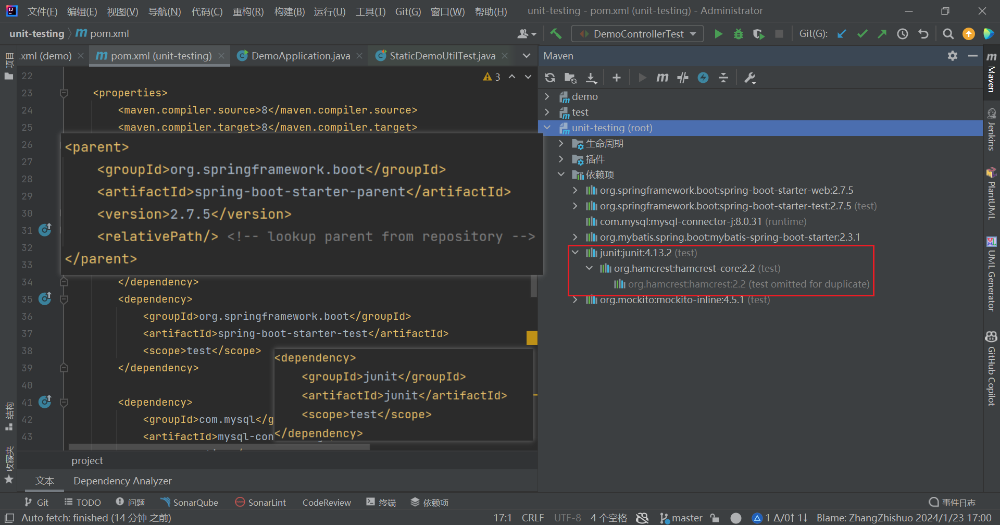
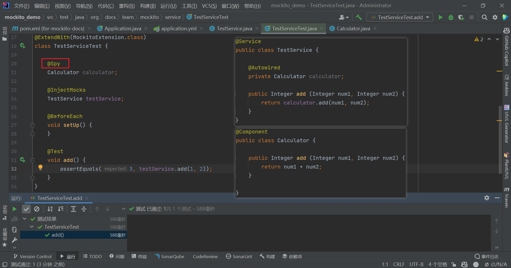
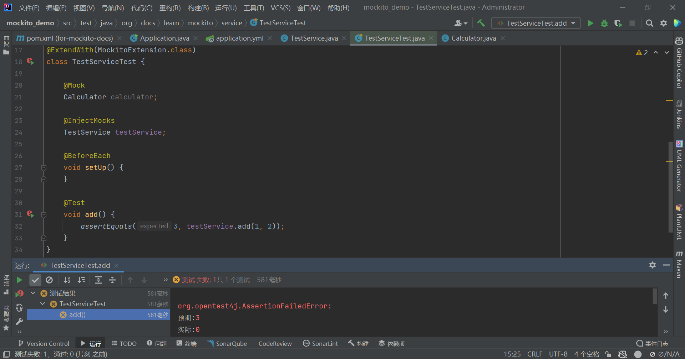
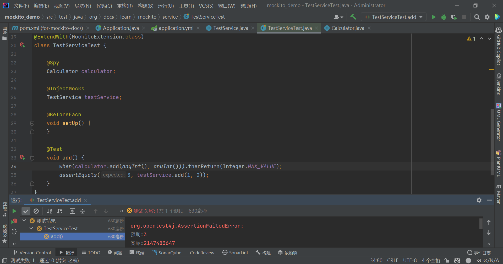
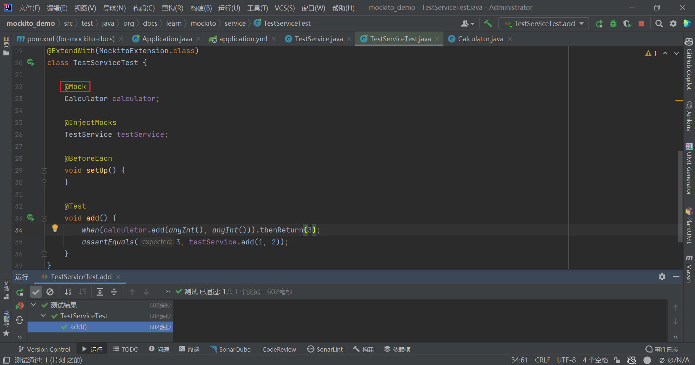
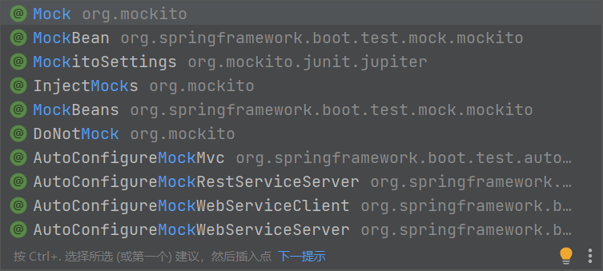
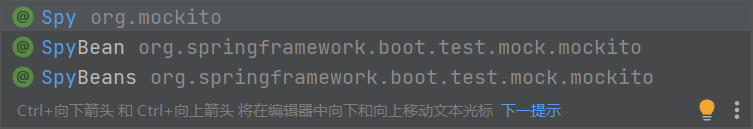
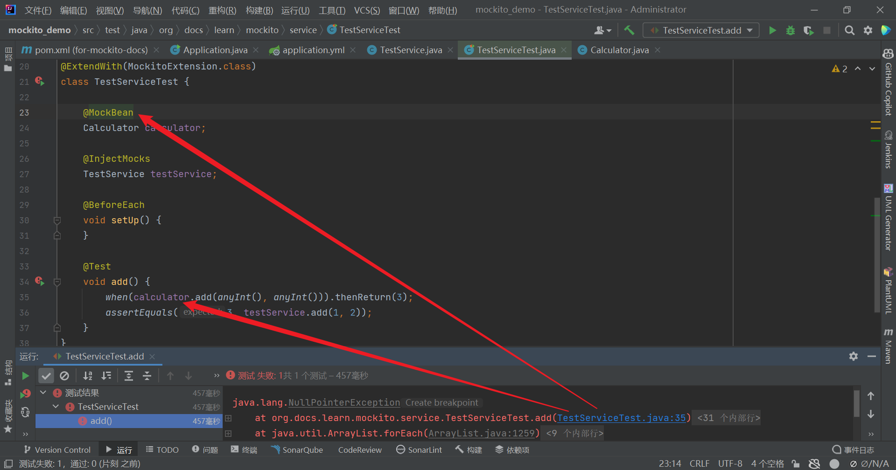
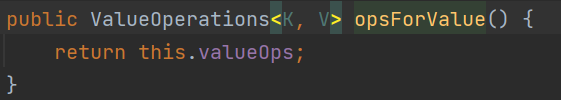

<h1 align="center">单元测试（Unit  Testing）</h1>

## Preface

笔者在开始写这篇文章之前（2024年1月31日）主要做了两个单元测试的项目，加深了一些对单元测试，甚至软件工程的理解，因此记录下来，包括一些方法论、实操和踩过的坑等方面（占大头）的东西，写下来细细品味、加深印象。当然，对于这些东西的理解不是两个项目就能搞定的，所以读者（如果有）将会在文档中看见大量的*`To be Continue...`*，代表笔者还在继续扩充自己的理解。

以上。

## Overview

单元测试的目的是检测一个独立的单元的正确性，并且排除该单元所依赖的模块的影响。特别要强调的是，既然是一个单元，那么它就不能保证一个整体的正确性，不能保证从顶层的模块开始，一直到自底向上返回都是正确的。并且，测试的时候要讲究粒度。从软件工程的角度来说，整体的正确性应该交给专门的步骤去做。 

**（可以去了解集成测试 、系统测试和验收测试，不在本文的范畴之内）** 

## Example

### Code

举个简单的例子，比如我有这样一个方法，姑且称它为一个API吧。另外，它是有要求的（当然了，不然就没有测试的必要了，在我的角度来看，逻辑达到一定复杂度的方法有必要测试，不然也属于浪费时间。当然，项目有要求的话要跟着项目的要求走，不要唱高调，逻辑复杂度低的方法写一个单元测试也不会累）：只加正数，如果不符合要求，应该抛一个异常（已经很好了，不能传null进来）：

```java
public class Util {
    public int onlyAddPositiveNumber (int a, int b) {
        if (!(a > 0 && b > 0))
            throw new IllegalArgumentException("All parameters should be positive number!");
        return a + b;
    }
}
```

我还有另外一个类，要引用这个方法：

```java
public class UpperLayer {
    private Util util = new Util();
    
    public void printAddResult () {
        int a = 1;
        int b = 2;
        System.out.println(util.onlyAddPositiveNumber(a, b));
    }
}
```

假设这就是这个项目的全部，现在我要做一个单元测试，依赖关系是这样：



如何保证项目的正确性呢？假设这个小东西要团队合作，写UpperLayer的同学不知道写Util的同学是怎么算的加法，写Util的同学也不敢保证自己的加法是对的，也不敢保证调用自己方法的同学是个符合人类逻辑的同学。这都是有可能的。

如果有接口文档，那么接口文档最起码是这样的（这里涉及到了接口文档的重要性，最起码看见了这个文档，调接口的同学知道怎么调，如果写Util的同学和写单元测试的同学不是一个人，那测试同学最起码知道要测什么情况，否则……只能对着代码写全都能通过的测试用例了，哈哈）

假设这是一个接口文档，当然接口文档不长这个样子。

|       接口名称        | 参数1  | 参数2  | 返回值 |                            说明                             |
| :-------------------: | :----: | :----: | :----: | :---------------------------------------------------------: |
| onlyAddPositiveNumber | a(int) | b(int) |  int   | 参数必须都为正数，<br/>否则抛出IllegalArgumentException异常 |

### Testing logic

怎么测试？看这个方法，要测试的点主要有这么几个：

- 传入参数正确，那应该返回正确的结果；
- 传入参数有一个错误（不是正数），应该抛出异常；
- 两个全都不合要求，那还是抛出异常；

考虑到项目对于值的要求，和项目可能传入的数据的大小，以及值出现误差是否会导致严重的问题，测试的时候还可以考虑是否加入以下逻辑：

- 两个正数都过大，会导致溢出，比如一个值给传了个`Integer.MAX_VALUE`；
- （以笔者的经验，目前就能想到一个）

你觉得这个逻辑如何呢？

## Main Text

正文开始，我会放一些我学习过程中发现的写的让我受益匪浅的博客，依然是帮助未来的我自己或读者理解，我会尽可能将所有重要的点写在这篇博客里，提供其他链接的目的是补充和复习，同时可以在浏览器上找到更多相关的文档继续学习。（CSDN上的链接就不放了，不一定什么时候官方就给你把它弄成收费的，真是让人……呃还是不说了）

### Benefits of Unit Testing

- 提升软件的质量；
- 将发现问题的时间提前；
- 使bug容易被修复，较于通过软件的行为和Java打印的异常栈来说，更容易定位问题的位置；
- 如果单元测试的质量达到标准，重构软件或升级软件会变得方便，比如有个方法需要扩充，但是对这个方法存在上一个版本的单元测试，那这个方法的行为依然可以通过单元测试来判定（个人认为这一点对原来版本的代码质量有一定要求，如果是因为原来的代码是一座什么山才要做的重构，那可能并没有这个优点）；
- *To be Continue...*

### How to Write Good Unit Tests 

这一part会是一堆类似设计原则性的东西，尽量遵守，会使你的单元测试写的更好。言外之意，就是并非所有场景都要完全遵守，要根据开发者的经验、具体场景，设计出最合适的单元测试。

**优秀博文链接：**

- [细数35个单元测试准则 - 知乎 (zhihu.com) ](https://zhuanlan.zhihu.com/p/148532009#:~:text=细数35个单元测试准则 1 1.保持单元测试小巧、快速 理论上，任何代码提交前都应该完整跑一遍所有测试套件。 保持测试代码执行符合预期，这样能够缩短迭代开发周期。 2 2.单元测试应该是全自动%2F非交互式的 测试套件通常是定期执行的，执行过程必须完全自动化才有意义。,7 7.由简入繁 再简单的测试也远远胜过完全没有测试。 ... 8 8.保持测试的独立性 ... 更多项目) 
- [未名企鹅极客 | 软件单元测试的基本原则 - 知乎 (zhihu.com)](https://zhuanlan.zhihu.com/p/339354290#:~:text=用例之间不允许互相调用，也不允许出现执行次序的先后依赖。,3、可重复性单元测试时可以重复执行的，不能受到外界环境的影响。 4、测试颗粒度要足够小编写单元测试时要保证测试粒度足够小，这样有助于精确定位问题，单元测试用例默认是方法级别的。) 
- [阿里巴巴java开发编码规范——单元测试 (taodudu.cc)](http://www.taodudu.cc/news/show-3682694.html?action=onClick) 
- *To be Continue...*

这句话我特别喜欢：**对于开发工程师来讲，编写并维护单元测试不仅仅是为了保证代码的正确性，更是一种基本素养的体现。**

步入正题，下面是一些我认为重要的原则，甚至是我认为必须遵守的：

- 对单元测试的粒度一定要控制。我举的例子可能有些极端，实际可能并不出现，但是我认为并不是抬杠，因为一旦出现问题，代价可能都很大。

  - 一般来说，都是一个方法对应一个测试方法来做单元测试。拿MVC三层架构来说，通常Controller类调用Service类，Service再调用DAO（或者有人叫Mapper、Repository，都可以）。假如想测试一个Service方法，确实是要调用DAO（即Service依赖DAO），但是我只是测试Service的正确性，DAO的行为与我无关，不能因为DAO的方法出错导致Service的单元测试也不通过。这倒还好，**<font color="red">我认为最严重的是DAO的结果出错，导致Service的单元测试结果反而通过了，从而隐藏了一个可能出现的bug！</font>**这是控制粒度的一部分原因。（具体方法可以见下面mockito框架的讲解）
  - 另外一个原因，我认为是控制了粒度，才能达到单元测试的其中一个目的：更好的定位问题，如果单元测试的范围太大，涉及到好多类的好多方法，导致一个用例的结果不通过，那我到哪里去定位问题呢？如果是多人合作，调用的是其他人的API，那我的方法到底有没有问题？这无疑增加了调试的难度。
  - 粒度太大，变成了集成测试做的事情，一位同学想测试Controller层，直接调用Controller的方法来看结果，是预期直接通过，那集成测试的环节还做什么，干脆取消算了。
  - 不允许方法之间相互调用，如果必须有，模拟返回值。

- 单元测试一定要自动化。很多人不理解什么是自动化，这里做一下解释：

  > <font color="red">直接说就是用断言代替输出的方式，无需测试人员人肉跑到控制台或者调试方法去检查是不是自己想要的结果。</font>
  >
  > 这有个例子：
  >
  > ```java
  > @Test
  > void insert() {
  >  // 插入成功的时候应该返回1
  >  int i = demoMapper.createUser("demo");
  >  // 验证结果
  >  logger.info(String.valueOf(i));
  >  System.out.println(i);
  > }
  > ```
  >
  > ```java
  > @Test
  > void insert() {
  >  // 插入成功的时候应该返回1
  >  int i = demoMapper.createUser("demo");
  >  // 验证结果
  >  logger.info(String.valueOf(i));
  >  assertEquals(1, i);
  > }
  > ```
  >
  > 两个方法在做一样的事情，就是在验证如果调用成功，这个mapper方法应该返回1，上面的方法根据Junit框架的特点，无论如何都会显示通过，这个时候就需要开发人员自己去找控制台输出，找到1了这才知道确实是通过了，而下面使用断言的方式，如果结果不符合预期，会自动化的告诉测试人员测试不通过。
  >
  > 另外现在还有一些自动化测试工具，像Jenkins等平台，可以自动拉取代码去测试，跑测试用例，我认为虽然像是“自动化”，但是不是这一点想要传达的中心。如果大家认为这都是自动化也可以，但是要有意识地记得这是不同的两点。

- 单元测试要全面，要有足够的覆盖率。这并不只是一个所谓的硬性指标，有些公司跟所谓“绩效”挂钩，只是这是评测绩效的一个手段，单元测试的覆盖率是有一定的依据在里面的。**真正业务逻辑的代码**（言外之意就是我们当然不会把所谓的“打日志”等代码也算在覆盖率里面）的单元测试覆盖率不够，必然有一些行为在直观的观察可以看到的范围之外的，就会造成可能隐藏bug。

  > 比如这个场景：我们在开始开发之前，规定了所有方法的行为应该是什么样子，并且根据这个规则写了单元测试，但是由于对单元测试的不够重视，并没有把所有的情况都测试到，如一个字段可以是1或0，只测了1的情况，0的情况因为觉得简单忽略掉了，并且单元测试在软件迭代时也没有继续更改，现在更新了需求，开发人员加的0的情况变得复杂了些并且存在一些问题，但是由于这个分支并没有覆盖，导致的情况是，测试依然通过，但是线上就有可能出问题了。
  >
  > ```java
  > public void someMethod (In in) {
  >  if (in.getType == 1) {
  >      // ...
  >  } 
  >  else if (in.getTypr == 0) {
  >      // ...
  >      // 后面这个方法更改的复杂了，但是由于没有测试这个分支，导致问题被隐藏了
  >      // 于是后面一些特定的情况下，问题暴露，就可能引发线上事故
  >  }
  > }
  > ```

- 除了IDE和IDE的插件检查的代码的覆盖率意外，还有“测试用例的覆盖率”，代码应该扛得住极端的测试用例。当然，有多极端，这是根据业务场景决定的，<font color="red">而且要根据接口文档和数据模型来做测试用例</font>，如果只是一个很少用户的内部系统，那没必要，如果这个系统可能输入的东西千奇百怪，那就要考虑到千奇百怪的测试用例，**看过一篇博客使用随机数的方式来覆盖测试用例，也不失为一种好方法**。<font color="red">笔者有时候拿SQL注入的预防来类比对测试用例的覆盖，一个系统应该对输入的参数有所控制。</font>

- *To be Continue...* 


---

*接下来是一些具体的东西，涉及到这个东西的落地，如何在项目中方便的写单元测试。* 

---

### Frameworks Usage Guide

#### Dependencies

依赖问题一直是一个让人头疼的问题，比如有的框架版本太高，会不支持Java8，这时候就得降级。这一部分就是举例子，说明需要什么依赖而已，当然如果您的项目中依赖的版本与我相同或类似，您也可以拿来就用。如果不是，选择版本和依赖的时候还是要根据项目的架构和其他依赖的版本来，比如需要mock私有方法，还需要PowerMock，注意是否和现在的mockito框架冲突。

##### Project1

[项目地址](https://gitee.com/pidanhub/unit-testing) 

在springboot中，可以集成很多现成的框架和库（最叫人头疼的事情就是依赖版本的问题）。我举两个具体的例子：

```xml
<!-- springboot的版本是2.7.5 -->
<parent>
    <groupId>org.springframework.boot</groupId>
    <artifactId>spring-boot-starter-parent</artifactId>
    <version>2.7.5</version>
    <relativePath/> <!-- lookup parent from repository -->
</parent>

<dependencies>
    <!-- other dependencies -->
    <!-- ... -->
    <!-- dependencies for unit testing -->
    <dependency>
        <groupId>org.springframework.boot</groupId>
        <artifactId>spring-boot-starter-test</artifactId>
        <scope>test</scope>
    </dependency>
    <dependency>
        <groupId>junit</groupId>
        <artifactId>junit</artifactId>
        <scope>test</scope>
    </dependency>
</dependencies>
```

<!-- 我们常用的测试框架就是junit了，至于这么写是什么版本的junit，从引入的maven依赖来看是junit4（如 --><!-- 图），但是查阅资料说是junit5，因此我暂时还不能确定，如果日后明确了版本信息，再来补充。 -->

<!---->

##### Project2

另外写的一个项目的依赖，这里做一个记录，方便以后阅读的人（也包括我自己）可以轻松的找到可以使用的版本以及排除的一些依赖的影响）：

```xml
<!-- springboot的版本是2.3.5.RELEASE -->
<parent>
    <groupId>org.springframework.boot</groupId>
    <artifactId>spring-boot-starter-parent</artifactId>
    <version>2.3.5.RELEASE</version>
    <relativePath/> <!-- lookup parent from repository -->
</parent>

<dependencies>
    <!-- other dependencies -->
    <!-- ... -->
    <!-- dependencies for unit testing -->
    <dependency>
        <groupId>org.springframework.boot</groupId>
        <artifactId>spring-boot-starter-test</artifactId>
        <scope>test</scope>
        <exclusions>
            <exclusion>
                <groupId>org.junit.vintage</groupId>
                <artifactId>junit-vintage-engine</artifactId>
            </exclusion>
            <exclusion>
                    <groupId>org.mockito</groupId>
                    <artifactId>mockito-core</artifactId>
            </exclusion>
        </exclusions>
    </dependency>
    
    <dependency>
        <groupId>junit</groupId>
        <artifactId>junit</artifactId>
        <scope>test</scope>
    </dependency>
    <dependency>
        <groupId>org.mockito</groupId>
        <artifactId>mockito-core</artifactId>
        <version>3.6.28</version>
        <scope>test</scope>
    </dependency>
    <dependency>
        <groupId>org.mockito</groupId>
        <artifactId>mockito-junit-jupiter</artifactId>
        <version>3.4.0</version>
        <scope>test</scope>
    </dependency>
    
    <dependency>
        <groupId>org.mockito</groupId>
        <artifactId>mockito-inline</artifactId>
        <version>4.5.1</version>
        <scope>test</scope>
    </dependency>

    <dependency>
        <groupId>org.springframework.boot</groupId>
        <artifactId>spring-boot-starter-webflux</artifactId>
    </dependency>
</dependencies>
```

##### *To be Continue...*

其中：

- `mockito-inline`是mockito框架mock静态方法时需要引入的依赖，单元测试基本无法离开它了，或者powermock框架也可以mock静态方法，笔者目前只用过这一个，如果有会继续补充。

- `mockito-core`单独引入是因为版本的问题，在第二个项目引入mockito时出现了版本冲突，不得已从SpringBoot的test中排除该版本，更换合适的mockito-core依赖版本。
- `spring-boot-starter-webflux`依赖是用来测试webflux框架的Controller层，用于发出请求和校验结果
- *To be Continue...* 


#### Usage

使用上能说的比较少，真正遇见了问题还是要查阅资料去解决，实际上在写测试的时候稍微有点偏差就会报错。这里记录一些常用、重要的操作。

##### Junit

**优秀博文链接：**

- [JUnit:完整指南 - 知乎 (zhihu.com)](https://zhuanlan.zhihu.com/p/522403734#:~:text=JUnit%3A完整指南 1 什么是JUnit？ JUnit是一个Java测试框架，使编写可靠和高效的测试变得容易。 ... 2 JUnit是如何工作的？ JUnit是一个软件测试框架，帮助开发人员测试他们的应用程序。,7 如何安装JUnit测试框架 在下面的部分，我们将让你知道如何安装JUnit。 ... 8 附录。 一些建立和运行测试的工具 ) 
- [单元测试 - 廖雪峰的官方网站 (liaoxuefeng.com)](https://www.liaoxuefeng.com/wiki/1252599548343744/1255945269146912) 
- [jUnit 教程_w3cschool](https://www.w3cschool.cn/junit/) （推荐）
- *To be Continue...* 


##### Mockito

**优秀博文链接：**

- [单元测试利器Mockito框架 - 知乎 (zhihu.com)](https://zhuanlan.zhihu.com/p/45175174) 
- *To be Continue...* 

这个框架比较重要，包括旧版的PowerMock，配合Junit可以做很多事情。创建被测对象（@InjectMocks），mock对象（@Mock、@MockBean、@MockBeans），spy对象（@Spy、@SpyBean、@SpyBeans），并模拟它们的行为。

>  Mockito中的Mock和Spy都可用于拦截那些尚未实现或不期望被真实调用的对象和方法，并为其设置自定义行为。
>
>  这么说很空洞，不论怎么解释都不如直接上证据来的可靠，所以——
>
>  举个例子吧，尽量叫它全面一点吧。注意`注解`使用的区别，不要在意测试是否通过，注意程序的行为和运行结果：
>
>  先不stub（打桩），看结果：
>
>  
>
>  
>
>  现在对两个方法进行打桩：
>
>  
>
>  
>
>  横向、纵向对比@Mock注解和@Spy注解，看出：@Spy注解，如果没有stub，会调用真实的方法，而@Mock注解则会返回默认值0（包括对象是null，boolean是false），stub之后，二者都会返回自定义的结果。

除了这个demo展示的stub以外，还有很多stub的方法，这里再举几个例子，实际应用时根据需求选择：

```java
@Test
void add() {
	when(calculator.add(anyInt(), anyInt())).thenReturn(3);
    // doReturn(3).when(calculator).add(anyInt(), anyInt());
    // when(calculator.add(anyInt(), anyInt())).thenThrow(RuntimeException.class);
    // doNothing().when(calculator).add(anyInt(), anyInt());
    assertEquals(3, testService.add(1, 2));
}
```

对于stub，有几点：

- mockito框架要求简洁，如果将方法打桩以后，实际却并没有调用这个方法，会抛出<font color="red">`org.mockito.exceptions.misusing.UnnecessaryStubbingException` </font>
- 参数可以使用`org.mockito.ArgumentMatchers.*`里面的any*()方法去做参数匹配（其中`any()`方法可以传入Class\<T\>对象来指明参数，使得方法重载也可以定位到参数）。**注意使用的时候，如果使用参数匹配，方法有多个重载，使用不合适的匹配方法会出错，因为框架会不知道具体应该对哪个方法打桩。**
- 对于上面的打桩方法，`第三行`和`第四行`的作用是相同的。的确，如果打桩void方法，确实是需要下面的那种方式。但是对于有返回值的方法，最好使用上面的方法，因为**下面的方法不会有类型检查**，如果代码有问题，就**只能在运行时发现问题，这不符合将问题提前到编写、编译时的原则**。
- 参数为null时，也容易报出问题。如果报错，可以考虑检查是否因为null导致的类型匹配错误。
- *To be Continue...({ "空值匹配失败的原因"， "参数匹配的机制" })*

##### Webflux

**优秀博文链接：**

- 
- *To be Continue...* 

提供一个传参方法：

```java
public class WebFluxTestUtil {

    public static String buildFormDataFromMap(Map<String, String> data) {
        StringBuilder formData = new StringBuilder();
        for (Map.Entry<String, String> entry : data.entrySet()) {
            if (formData.length() > 0) {
                formData.append("&");
            }
            formData.append(entry.getKey())
                    .append("=")
                    .append(entry.getValue());
        }
        return formData.toString();
    }
}
```


### Encountered Puzzling Scenarios

这一part是踩坑记录，主要是本人在学习过程中注意到的知识点，还有些在实际应用中遇到的问题。其中每一个问题中对于问题的解释，有一部分是互联网上给的解答，也有一部分是自己的推测，因此不能保证解释的完全正确，只能保证我已经力求信息有根据才写在这里。**但是这些记录最低可以帮助做到一件事，那就是——照着正确的来，肯定是可以解决问题**。至于解释，来寻找官方正确的解释的同学自行忽略便是。**但是如果发现错误，一定告诉笔者，笔者会在收到并验证后，第一时间更正，先表示感谢！**

<!-- 慢慢记录吧兄弟 -->

#### Questions about Mockito's Annotations

注意看注解对应的包名：





<font color="red">从包名可以看出来，有些注解是mockito提供的，有些则是SpringBoot提供的。有时我们在单元测试的时候，并不希望启动SpringBoot框架或者说Spring容器，因为这样会太过耗时。既然这样就不要使用SpringBoot提供的注解，否则会报这样的错误：</font>



我的理解是：Spring容器并未启动，在这种情况下，获取不到这个对象，自然会报空指针的错误。同理，@SpyBean也会出现同样的错误。

#### MockMvc Cannot Test an Asynchronous Framework

目前这个问题就只在Webflux框架的Controller遇见过，同样的代码，没有使用Mono封装返回体的时候，mockMvc可以正常测试并获得返回结果，如果是Webflux，则无法获得返回结果，需要使用WebFluxTest的WebTestClient测试。比如：

```java
private void request (boolean paramsLine) {
    result =webClient.post()
            .uri(uri)
            .contentType(MediaType.APPLICATION_FORM_URLENCODED)
            .bodyValue(paramsLine ? params : "")
            .exchange()
            .expectStatus().isOk()
            .expectBody(RspBase.class)
            .returnResult();
    responseBody = result.getResponseBody();
}
```

#### Mock Redis

对redis的操作进行mock，假如有这样一段代码：

```java
if (StringUtils.isNotBlank(date)) {
    stringRedisTemplate.opsForValue().set(redisKey, date);
}
```

查看`stringRedisTemplate.opsForValue()`这个方法，返回一个`ValueOperations`：



打桩方法：

```java
ValueOperations valueOperationsMock = mock(ValueOperations.class);
when(stringRedisTemplate.opsForValue()).thenReturn(valueOperationsMock);
when(valueOperationsMock.get(any())).thenReturn("-");
```
